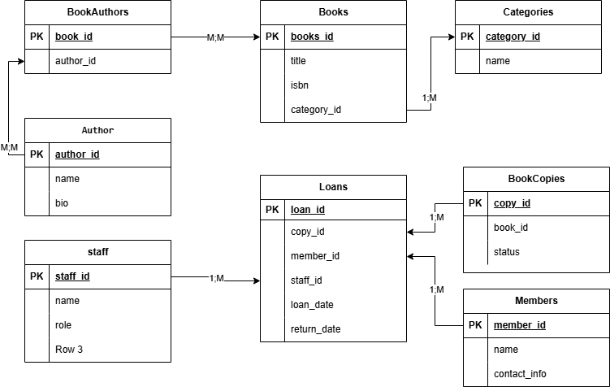

# Library Management System

## Description
This project is a MySQL-based database system for managing a library. It handles books, authors, book copies, categories, members, loans, and staff.

## How to Run
1. Open your MySQL environment (MySQL Workbench or CLI).
2. Import the SQL script: library_db.sql.
3. The script will create all tables with appropriate constraints and relationships.

## Tables Included
- Authors
- Books
- BookAuthors (for many-to-many relationship)
- Categories
- BookCopies
- Members
- Staff
- Loans

## ERD Diagram
